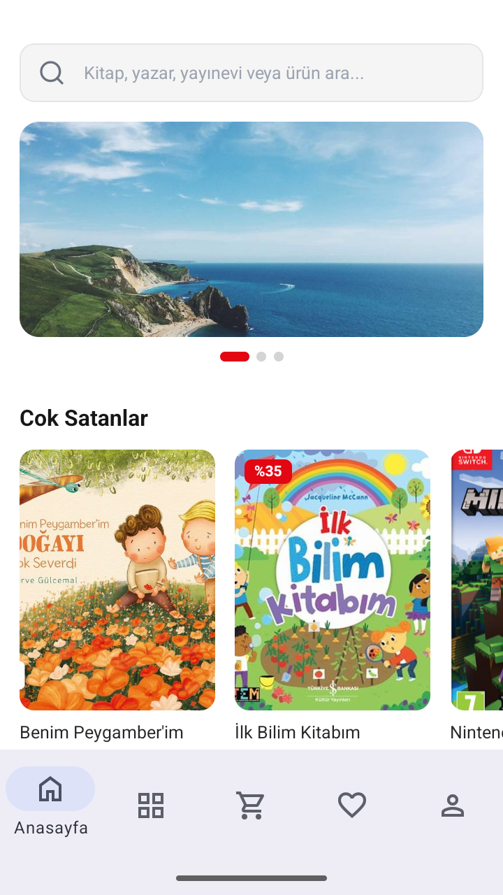
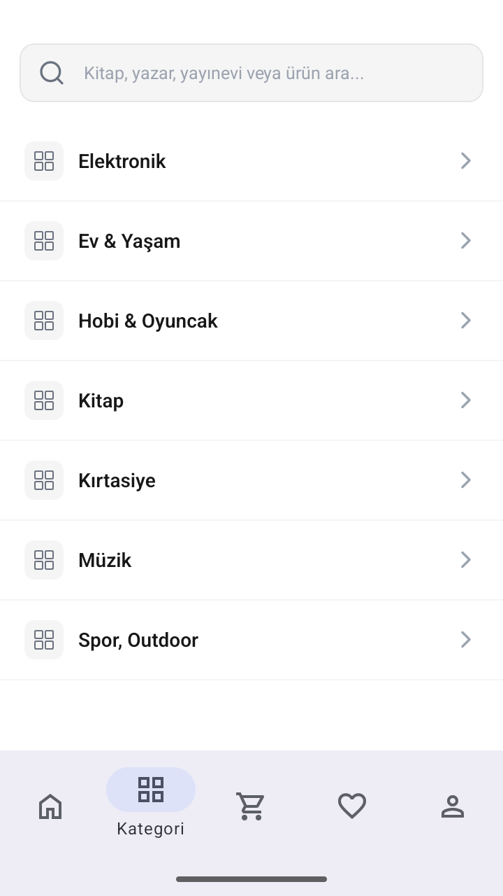
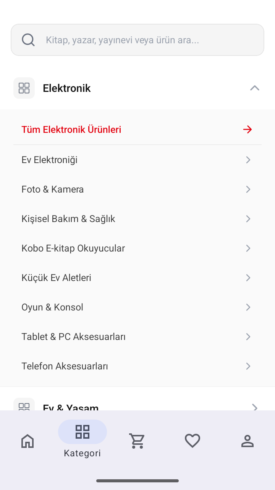
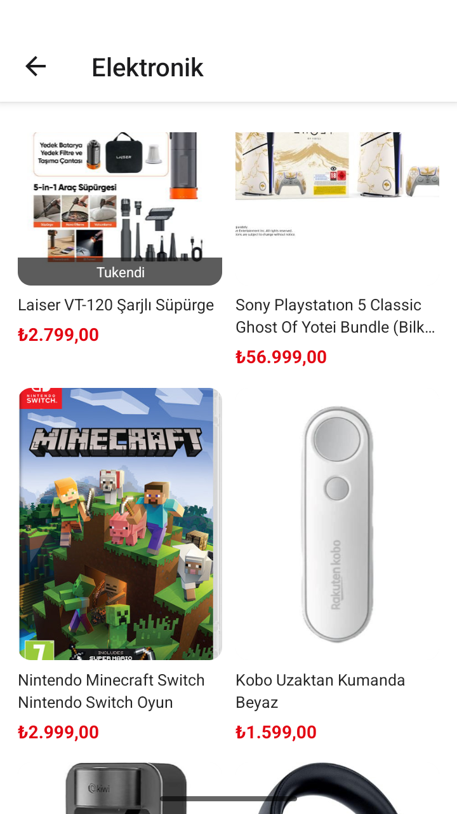
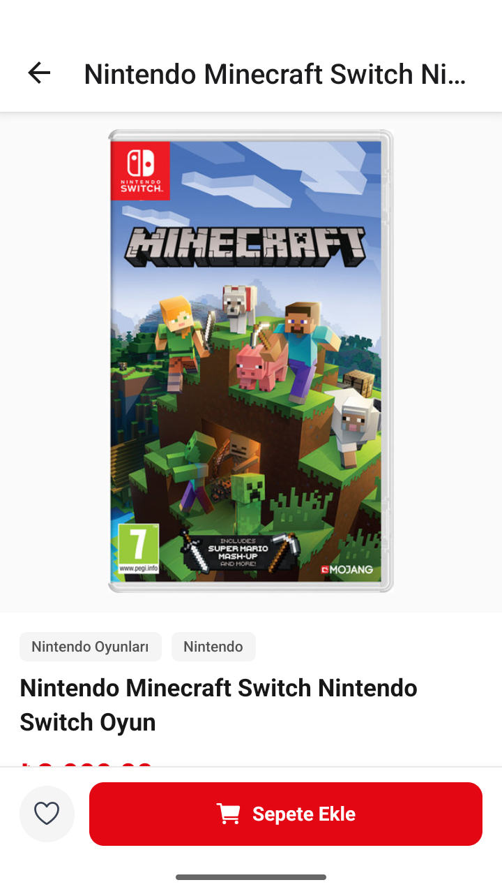
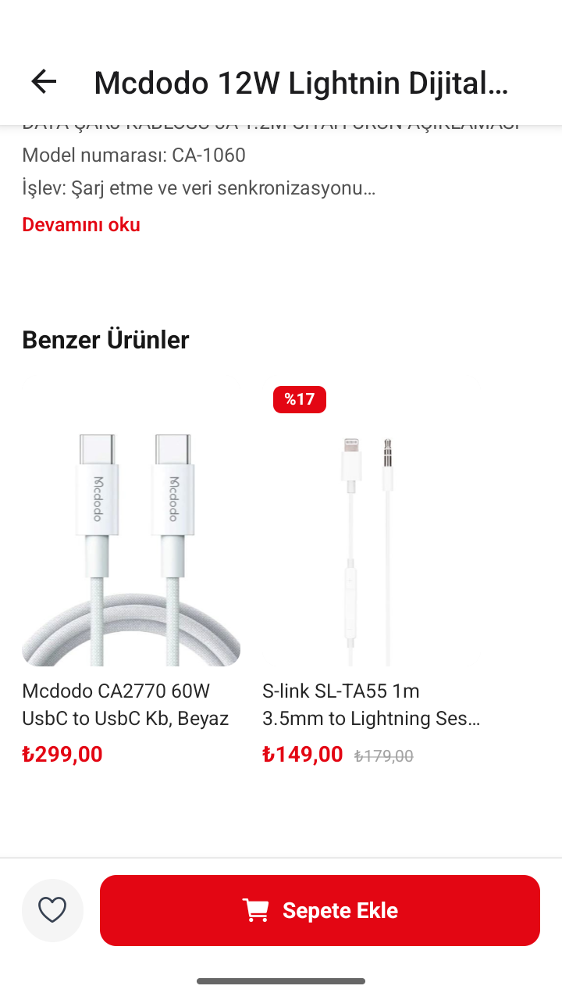
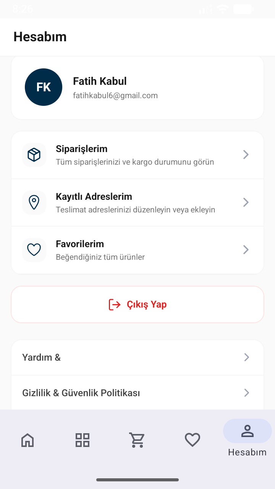
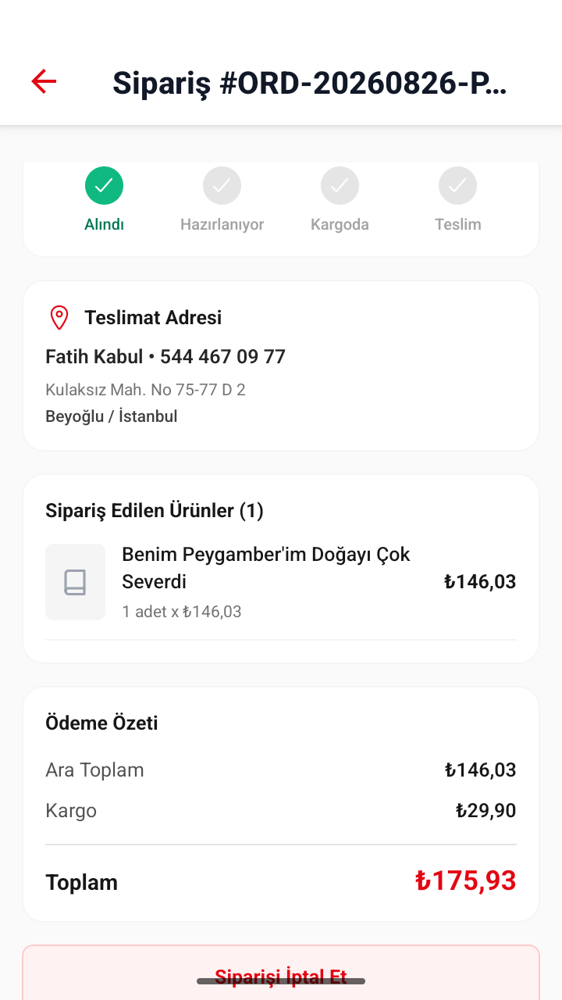
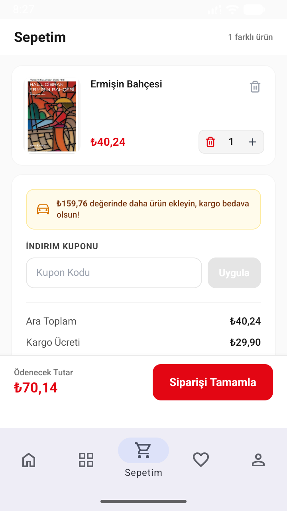
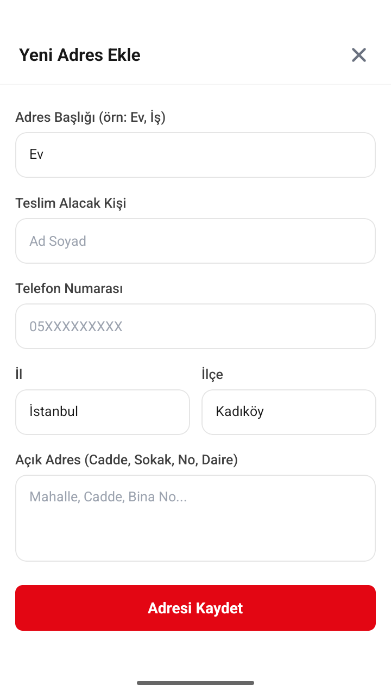

# E-Ticaret Mobil Uygulaması

Bu proje, React Native ve Expo altyapısı kullanılarak geliştirilmiş, modern, hızlı ve kullanıcı dostu bir e-ticaret mobil uygulamasıdır. Kullanıcıların ürünleri kolayca inceleyebileceği, arama yapabileceği ve hesaplarını yönetebileceği kapsamlı bir alışveriş deneyimi sunar.

## Temel Özellikler

*   Geniş Ürün Kataloğu: Kullanıcılar çeşitli kategorilerdeki ürünleri detaylı bir şekilde inceleyebilir.
*   Gelişmiş Arama: İstenilen ürünlere hızlıca ulaşmak için optimize edilmiş arama ve filtreleme seçenekleri.
*   Kullanıcı Hesabı Yönetimi: Profil bilgileri, favori ürünler ve sipariş geçmişi gibi detayların kontrol edilebildiği kullanıcı paneli.
*   Sepet ve Ödeme: Pürüzsüz ve güvenli bir satın alma süreci.
*   Modern ve Şık Tasarım: Mobil cihazlara tam uyumlu, akıcı animasyonlar barındıran temiz bir kullanıcı arayüzü.

## Ekran Görüntüleri

Aşağıda uygulamanın farklı bölümlerinden alınan ekran görüntülerini inceleyebilirsiniz:

  
  
  

  
  
  

  
  
  

  

